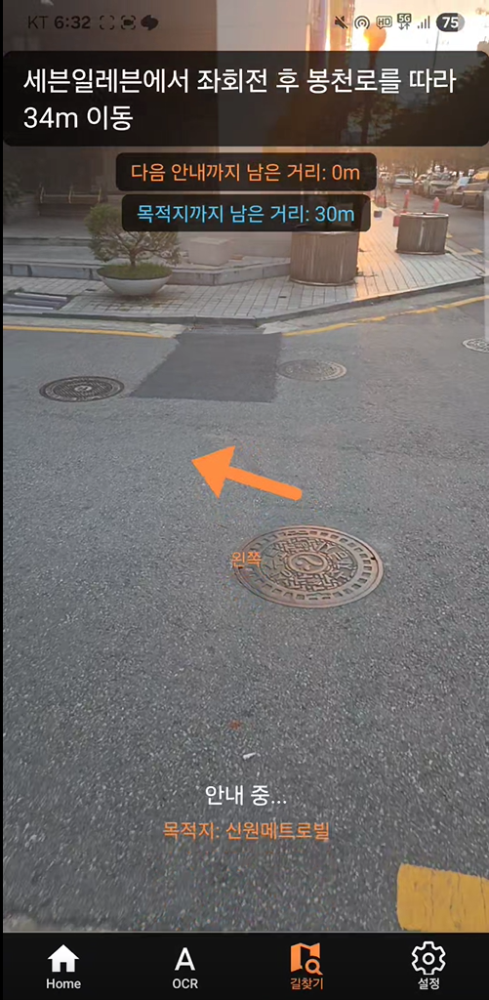
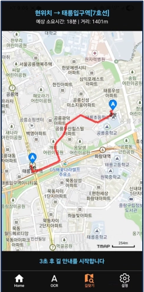
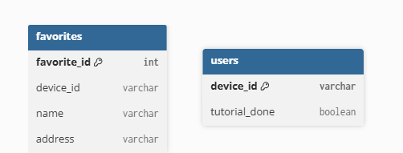

# VisionOfVision Navigation

시각장애인의 보행을 지원하기 위해 개발한 **VisionOfVision AI 비서 앱의 길찾기 기능**입니다.

본 저장소는 전체 프로젝트 코드가 아니라, 프로젝트에서 직접 담당한 **React Native 기반 길찾기 프론트엔드와 Flask·MySQL 기반 길찾기 즐겨찾기 백엔드**를 중심으로 정리한 포트폴리오용 저장소입니다.

## 📱 Screenshots

<p align="center">
  
  
  
</p>

## 담당 기능

### 1\. 길찾기 프론트엔드

React Native(Expo) 환경에서 현재 위치 확인부터 목적지 검색, 보행자 경로 안내, 경로 이탈 감지 및 자동 재탐색까지 구현했습니다.

주요 기능은 다음과 같습니다.

* Expo Location 기반 현재 GPS 위치 획득
* TMAP Reverse Geocoding을 이용한 현재 위치 주소 변환
* 텍스트 및 STT 기반 목적지 입력
* TMAP Geocoding을 이용한 목적지 좌표 변환
* TMAP 보행자 경로 API 연동
* 경로 응답의 Point/description 기반 턴바이턴 안내 구성
* Haversine Formula 기반 현재 위치-안내 지점-목적지 거리 계산
* 안내 지점 접근 시 TTS 및 진동 안내
* 안내 완료 지점 상태 관리를 통한 중복 안내 방지
* 안내 지점과의 거리 변화 기반 경로 이탈 감지
* 현재 GPS 위치 기준 TMAP 자동 경로 재탐색
* Heading/Bearing 기반 진행 방향 안내
* STT 목적지 입력 정규화 및 오인식 보정
* TTS-STT 에코 방지
* React Navigation Life Cycle 기반 실시간 자원 관리
* YOLO 위험 감지 결과를 TTS·진동·Overlay와 연계

\---

## 2\. 길찾기 즐겨찾기 백엔드

사용자가 자주 이용하는 목적지를 저장하고 다시 길찾기에 활용할 수 있도록 Flask 기반 REST API를 구현했습니다.

주요 기능은 다음과 같습니다.

* Flask 기반 즐겨찾기 CRUD REST API
* MySQL 연동
* `device\_id` 기준 기기별 즐겨찾기 데이터 관리
* `favorite\_id + device\_id` 조건을 이용한 수정·삭제
* `ON DUPLICATE KEY UPDATE` 기반 중복 데이터 처리
* SQL Parameter Binding 적용
* 데이터 변경 후 `commit()` 및 DB Connection 정리
* AWS SSM Parameter Store 기반 DB 인증정보 관리
* 저장한 주소와 TMAP 길찾기 기능 연계

사용 흐름은 다음과 같습니다.

```text
목적지 검색
   ↓
길찾기
   ↓
목적지 도착
   ↓
즐겨찾기 저장
   ↓
즐겨찾기 목록 조회
   ↓
저장 주소 선택
   ↓
TMAP 경로 탐색
```

\---

## Tech Stack

## Frontend

* React Native
* Expo
* React Navigation
* React Hooks
* Expo Location
* Expo Camera
* Expo Speech
* React Native Vibration
* Socket.IO Client
* TMAP API

## Backend

* Python
* Flask
* MySQL
* mysql.connector
* boto3
* AWS SSM Parameter Store

## 🗄️ Database Structure

<p align="center">
  
</p>

즐겨찾기 기능은 `device\_id`를 기준으로 기기별 데이터를 관리합니다.

* `users.device\_id`: 기기 식별자
* `favorites.favorite\_id`: 즐겨찾기 식별자
* `favorites.device\_id`: 기기별 즐겨찾기 구분
* `favorites.name`: 즐겨찾기 이름
* `favorites.address`: 저장 주소

즐겨찾기 수정 및 삭제 시 `favorite\_id + device\_id` 조건을 함께 사용해 특정 기기의 데이터를 대상으로 처리합니다.

## Deployment

* AWS EC2
* GitHub Actions
* SSH
* GitHub Secrets

\---

# Project Structure

```text
visionofvision-navigation/
│
├── frontend/
│   ├── screens/
│   │   └── navigation/
│   │       ├── NavigationScreen.js
│   │       ├── RouteScreen.js
│   │       ├── GuideScreen.js
│   │       └── YoloDanger.js
│   │
│   ├── services/
│   │   └── stt/
│   │       └── useAutoSTT.js
│   │
│   ├── utils/
│   │   └── navigation/
│   │       ├── location.js
│   │       ├── navigationUtils.js
│   │       └── tmap.js
│   │
│   └── package.json
│
├── backend/
│   └── favorites/
│       └── favorites.py
│
├── .github/
│   └── workflows/
│       └── deploy.yml
├── docs/
│  └─ images/
│     ├─ navigation-search.png
│     ├─ navigation-guidance.png
│     ├─ navigation-route-map.png
│     └─ favorites-erd.png
├── .gitignore
├── requirements.txt
└── README.md
```

\---

## Navigation Flow

```text
NavigationScreen
│
├─ 현재 GPS 위치 확인
├─ TMAP Reverse Geocoding
├─ Text / STT 목적지 입력
├─ STT 입력 정규화
└─ TMAP Geocoding
        ↓
     Route
        ↓
   GuideScreen
        │
        ├─ TMAP 보행자 경로 요청
        ├─ 안내 Point 추출
        ├─ Haversine 거리 계산
        ├─ TTS / 진동 턴바이턴 안내
        ├─ 경로 이탈 감지
        ├─ 자동 경로 재탐색
        ├─ Heading/Bearing 방향 안내
        └─ YOLO 위험 감지 결과 연계
```

\---

### Key Implementation

## 현재 위치 및 목적지 처리

`NavigationScreen`에서는 Expo Location을 이용해 현재 GPS 좌표를 가져옵니다.

현재 좌표는 TMAP Reverse Geocoding을 통해 주소 형태로 변환하며, 사용자가 입력한 목적지명은 TMAP Geocoding을 통해 위도·경도 좌표로 변환합니다.

이후 다음 데이터를 길찾기 화면으로 전달합니다.

```text
currentLocation
destination
destinationCoords
```

\---

## STT 기반 목적지 입력

시각장애인 사용자가 키보드 입력 없이 목적지를 지정할 수 있도록 STT 입력을 지원합니다.

STT 결과를 그대로 검색에 사용하지 않고 다음 과정으로 정규화합니다.

```text
STT Raw Text
    ↓
문장부호 / 공백 정리
    ↓
조사 제거
    ↓
Dictionary Mapping
    ↓
정규표현식 기반 오인식 보정
    ↓
TMAP Geocoding
```

예를 들어 반복적으로 발생한 장소명 오인식을 다음과 같이 보정했습니다.

```text
구디      → 구로디지털단지
구디역    → 구로디지털단지역
슬림역    → 신림역
강남 여   → 강남역
```

또한 객체 인식, OCR, 설정, 취소와 같은 음성 명령은 목적지 검색보다 먼저 판단하여 앱 내 화면 이동 명령으로 처리합니다.

\---

# TTS-STT Echo Prevention

STT 시작 전에 앱이 안내 TTS를 출력하면, 해당 음성이 다시 마이크를 통해 STT 입력으로 인식되는 문제가 발생할 수 있었습니다.

이를 해결하기 위해:

* TTS 직후 1.2초 Suppression Window 적용
* 동일 시간만큼 STT 활성화 지연
* Suppression Window 내부의 STT 결과 무시
* 일정 시간 사용자 입력이 없으면 STT 종료 및 재시도 안내

방식을 적용했습니다.

```text
TTS 안내
   ↓
Suppression Window
   ↓
STT 활성화
   ↓
사용자 음성 입력
```

> 1.2초 등의 값은 성능 지표가 아니라 실제 구현에 사용한 제어 기준입니다.

\---

# Pedestrian Route Guidance

TMAP 보행자 경로 API 응답에서 전체 데이터를 그대로 사용하는 대신, 실제 길안내에 필요한 Point만 추출했습니다.

```text
features
  ↓
geometry.type === Point
  ↓
properties.description 존재 여부 확인
  ↓
Guide Point 생성
```

각 Guide Point는 다음 정보를 관리합니다.

```text
description
latitude
longitude
```

이를 현재 위치와 비교하여 턴바이턴 안내를 제공합니다.

\---

# Distance Calculation

현재 위치와 안내 지점 및 목적지 간 거리는 Haversine Formula를 이용해 직접 계산했습니다.

이를 다음 기능에 활용했습니다.

* 다음 안내 지점까지 남은 거리
* 목적지까지 남은 거리
* 안내 지점 접근 여부
* 경로 이탈 여부

\---

# Route Deviation \& Recalculation

사용자가 기존 경로에서 이탈한 상황에서도 이전 안내가 계속되는 문제를 해결하기 위해 안내 지점까지의 거리 변화를 추적했습니다.

동일한 안내 Point를 추적하고 있는 상태에서 현재 거리가 이전 측정값보다 일정 수준 이상 증가하면 경로 이탈로 판단합니다.

```text
현재 GPS 위치
     ↓
가장 가까운 미안내 Point 탐색
     ↓
이전 거리와 현재 거리 비교
     ↓
거리 증가
     ↓
경로 이탈 판단
     ↓
현재 GPS를 새로운 출발점으로 설정
     ↓
TMAP 경로 재요청
```

재탐색 완료 후 기존 안내 이력을 초기화하고 새로운 경로 기준으로 안내를 계속합니다.

\---

# Heading / Bearing Guidance

Expo Location의 Heading 정보와 현재 위치에서 목적지까지의 Bearing을 계산하여 사용자가 진행해야 할 상대 방향을 구합니다.

```text
Relative Angle
=
Destination Bearing
-
Device Heading
```

상대각에 따라 다음과 같은 방향 안내를 제공합니다.

```text
정면
조금 오른쪽
오른쪽
뒤쪽
왼쪽
조금 왼쪽
```

시각적 지도 확인이 어려운 사용자를 고려하여 결과를 TTS로 전달합니다.

\---

# YOLO Result Integration

길찾기 화면에서 Expo Camera로 카메라 프레임을 획득하고Socket.IO 기반 실시간 통신을 통해 AI 서버에 전달합니다.

서버에서 전달받은 Detection 결과를 이용하여:

* 객체 종류
* Bounding Box
* 객체의 좌/우 위치
* 위험 객체 접근 여부

를 길찾기 화면의 TTS·진동·Overlay와 연계했습니다.

본 저장소에서는 YOLO 모델 자체 개발보다 **AI Detection 결과를 실제 길찾기 사용자 인터페이스에 연계한 부분**을 중심으로 다룹니다.

\---

# Favorites REST API

즐겨찾기 기능은 다음 API로 구성했습니다.

|Method|Endpoint|Description|
|-|-|-|
|GET|`/setting/favorites`|device\_id별 즐겨찾기 조회|
|POST|`/setting/favorites`|즐겨찾기 등록|
|PUT|`/setting/favorites/<id>`|즐겨찾기 수정|
|DELETE|`/setting/favorites/<id>`|즐겨찾기 삭제|

수정 및 삭제 시 `favorite\_id`뿐 아니라 `device\_id`도 함께 조건으로 사용합니다.

```sql
WHERE favorite\_id = %s
AND device\_id = %s
```

SQL Query에는 Parameter Binding을 적용했습니다.

\---

# AWS SSM Parameter Store

MySQL 접속정보를 Python 소스코드에 직접 작성하지 않고 AWS Systems Manager Parameter Store에서 실행 시 조회하도록 구성했습니다.

관리 대상:

```text
DB Host
DB User
DB Password
DB Database
```

`WithDecryption=True`를 사용해 암호화 Parameter를 복호화하고 환경변수에 저장한 뒤 MySQL Connection 생성 시 사용합니다.

```text
AWS SSM
   ↓
boto3
   ↓
Environment Variable
   ↓
mysql.connector
```

\---

# Deployment

백엔드 소스는 AWS EC2에 배포했습니다.

실제 프로젝트에서는 main 브랜치 Push를 트리거로 AWS EC2에 최신 코드를 자동 반영하도록 GitHub Actions workflow를 구성했습니다.
포트폴리오용 저장소에서는 실제 서버 배포를 방지하기 위해 수동 실행(workflow\_dispatch) 방식으로 변경했습니다.

```text
Push to main
    ↓
GitHub Actions
    ↓
SSH
    ↓
AWS EC2
    ↓
git fetch
    ↓
git reset --hard FETCH\_HEAD
```

SSH Key, EC2 Host/User, GitHub PAT와 같은 값은 GitHub Secrets로 관리합니다.

본 프로젝트에서는 테스트·빌드 단계까지 포함한 전체 CI 파이프라인보다 **GitHub Actions 기반 EC2 자동 배포**를 구현한 경험에 초점을 둡니다.

\---

# Troubleshooting

## 1\. TTS 음성이 STT에 다시 입력되는 문제

**Problem**

앱에서 출력한 목적지 입력 안내 TTS가 마이크에 다시 입력되어 STT 결과로 처리될 수 있었습니다.

**Solution**

* Timestamp 기반 Suppression Window 적용
* STT 활성화 지연
* Suppression 구간의 STT 결과 무시

**Result**

앱 자체 안내 음성이 목적지 검색 입력으로 다시 처리되는 흐름을 차단했습니다.

\---

## 2\. STT 장소명 오인식

**Problem**

지하철역 및 장소명이 반복적으로 잘못 인식되었습니다.

**Solution**

* Dictionary Mapping
* 조사 제거
* 정규표현식 기반 후처리

**Result**

오인식된 문자열을 TMAP 검색에 활용 가능한 목적지명으로 정규화했습니다.

\---

## 3\. 경로 이탈 후 기존 안내가 지속되는 문제

**Problem**

사용자가 최초 경로를 벗어나도 기존 Guide Point를 기준으로 안내가 지속될 수 있었습니다.

**Solution**

안내 Point와의 거리 변화를 추적해 경로 이탈을 판단하고 현재 GPS 위치를 출발점으로 TMAP 경로를 다시 요청했습니다.

**Result**

사용자의 실제 이동 위치를 기준으로 새로운 경로를 생성하고 안내를 재개하도록 구현했습니다.

\---

## 4\. 화면 전환 이후 실시간 기능이 남는 문제

**Problem**

화면을 이동한 이후에도 STT, TTS, Timer, Heading Subscription, WebSocket 등의 실시간 자원이 남을 가능성이 있었습니다.

**Solution**

`useIsFocused`, `useFocusEffect`, Effect Cleanup을 이용해 화면 Life Cycle에 맞춰 관련 자원을 정리했습니다.

**Result**

화면 이탈 이후 불필요한 실시간 기능 실행과 중복 동작을 방지했습니다.

\---

# Security

GitHub 공개 저장소에는 실제 인증정보를 포함하지 않습니다.

다음 정보는 코드에 직접 작성하지 않습니다.

```text
TMAP API Key
EC2 IP / Host
DB Host
DB User
DB Password
AWS Access Key
SSH Private Key
GitHub PAT
```

환경변수, AWS SSM Parameter Store, GitHub Secrets 등을 이용해 분리합니다.

`.env`, `.pem`, `.key` 파일은 Git에 포함하지 않습니다.

\---

# Notes

본 저장소는 VisionOfVision 전체 프로젝트를 공개하기 위한 저장소가 아닙니다.

포트폴리오 목적으로 **직접 담당한 길찾기 기능과 즐겨찾기 백엔드 코드를 중심으로 재구성**했습니다.

프로젝트 전체에는 OCR, 객체 인식, 음성 인터페이스 등 다른 기능도 포함되어 있으나, 본 저장소에서는 직접 구현·연계한 길찾기 영역을 중심으로 설명합니다.

또한 코드에 존재하는 거리, 시간, 각도 등의 임계값은 성과 지표가 아닌 기능 구현을 위한 설계 기준입니다.

